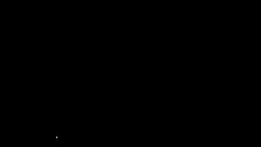
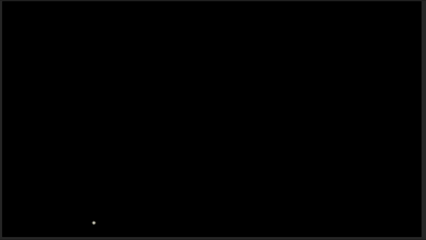
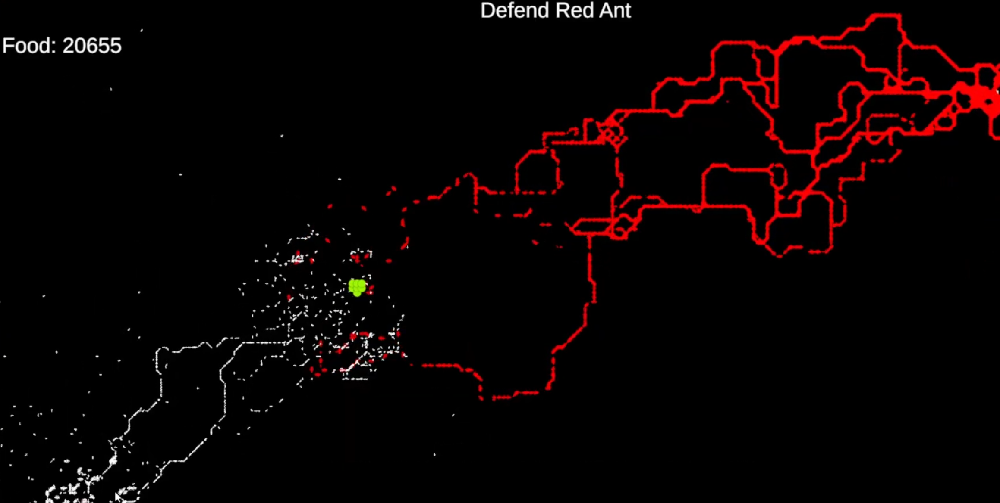
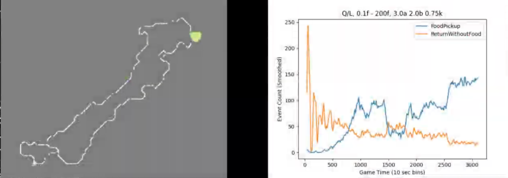
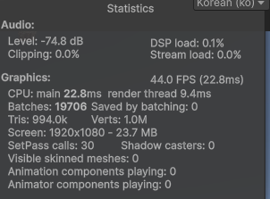

# ANTING 상세
# 캐시 지역성 최적화

### 배열 평탄화
(1) CPU는 연산을 위해 레지스터로 값을 가져옵니다. 먼저 CPU 내부의 캐시에 값이 있는지 확인하는데 L1/L2/L3...에 모두 없다면 RAM에서 값을 가져옵니다. RAM은 물리적으로 거리가 멀어 한 번의 Memory Fetch에 드는 시간이 캐시 접근에 비해 무척 길며, 그동안 CPU는 대기하기 때문에 대책으로 64 byte의 Cache Line을 한 번에 가져와 fetch 빈도를 낮추려 합니다. 때문에 계산에 사용되는 값이 64bit 내에 밀집해 있으면 한 번의 Memory Fetch만으로 64번의 Cache Hit를 유도할 수 있습니다.

(1-1) Anting에는 맵당 최소 세 개의 배열(e.g. 지형 정보/자원 페로몬/공격 페로몬)이 존재합니다. 다차원 배열로 데이터를 저장할 경우 List<List<T>...>나 int[][]같은 가변 배열은 이를 구성하는 1차원 배열 간에 물리적 거리가 존재해 캐시 지역성에 구멍이 생깁니다. 비록 큰 성능 향상은 없지만, 맵은 불변 구조인 동시에 불필요한 데이터가 없으므로 가변 배열의 구조적 이점을 살릴 방향이 없어 소소한 캐시 지역성의 이점이 있는 정방향 배열을 선택했습니다. [PheromoneMap.cs](PheromoneMap.cs)

(1-2) 개미 에이전트들은 기본적으로 주변 8칸의 정보를 참조합니다. 이 때 다차원 정방향 배열에서 arr[pos.x + 1, pos.y + 1]로 접근시 (y + 1) * width + x + 1 의 인덱싱 과정을 거치지만 1차원 배열이라면 pos를 기준으로 arr[pos + width + 1]의 인덱싱 계산 단순화가 가능합니다. 배열 인덱싱이 10K 개미 에이전트 핫루프에서 참조되기 때문에 가능한 모든 최적화가 필요했으며 계산 단순화를 위해 다차원 배열을 1차원 배열로 평탄화(정방향 배열이라 메모리 구조는 동일하지만)했습니다.

### Pointer Chain
(1) 클래스 안의 클래스 속 변수에 접근할 떄 참조 타입 변수를 타고타고 추적하는 pointer chain이 발생해 그만큼의 memory fetch가 발생합니다.추상화는 재사용성과 확장성 등의 장점을 제공하지만 대가로 컴퓨터 자원을 추가로 요구하며 pointer chain도 그 중 하나입니다. 추가적인 memory fetch 가능성이 있는 pointer chain는 핫루프에서 치명적일 수 있기에 핫루프에서 사용되는 변수는 책임 분리에 의한 클래스 분리 대상에서 제외하고, 최대한 한 곳에 뭉쳐 넣었습니다. 그렇지 못 한 변수는 변수를 포함하고 있는 클래스를 캐싱해 pointer chain를 최소화했습니다.

(2) 성능적인 측면에서 핫루프 속 인터페이스는 virtual dispatch를 일으킵니다. 이는 컴파일러가 실제 타입을 몰라 인라인이 불가하며 branch 예측도 어렵기에 런타임 성능에 치명적입니다. vtable을 통해 구현 메서드를 찾는 과정에서 pointer chain이 일어나 성능에 영향을 미치기 때문에, 10K 에이전트를 감당해야 하는 대규모 시뮬레이션을 위해 인터페이스 사용을 최소화했습니다.

<!-- (2) interface는 메서드 구현체가 컴파일타임이 아닌 런타임 중에 정해지는 virtual dispatch 비용이 발생합니다. interface의 메서드는 구현체에서 vtable에 저장되며, 함수 호출시 동일하게 구현체의 vatable을 따라 실제 구현 메서드를 찾게 됩니다. 이 때, vatable을 따라 type metadate 메모리를 페치하는 비용, 그 후 실제 메서도가 담긴 메모리를 페치하는 비용이 발생하는 point chain이 발생합니다. 핫루프에서는 치명적이기에 10k 개미 에이전트들이 활동하는 anting에서는 interface를 비롯한 다형성의 사용을 최소하했습니다. -->

https://lukasatkinson.de/2018/interface-dispatch/
https://mattwarren.org/2020/02/19/Under-the-hood-of-Default-Interface-Methods/

# 개미 군집 알고리즘의 컨텐츠화

### 개미 군집 알고리즘의 게임 컨텐츠화

(1) 개미 군집 알고리즘의 기반이 되는 개미 군집 최적화(Ant Colony Optimization)은 해를 구축하는 과정이 확률적인 메타 휴리스틱 알고리즘입니다. 알고리즘의 핵심인 개미들은 페로몬을 근거로 의사결정을 진행합니다. 이 알고리즘이 게임 속에서 충분히 개미처럼 보여진다면, 개미를 토대로 다양한 환경에서 인프라를 형성하고 다양한 적을 디펜스하는 콜로니 시뮬레이션 게임을 만들 수 있었습니다. 기술 테스트를 위해 가장 기초적인 Ant System 알고리즘을 적용했습니다. AntMover로 에이전트들을 이동시키고, 내부에 NodeSelector 구현체를 넣어 다음 노드 선택 로직을 구현했습니다. 에이전트들이 이동 중에 음식과 같은 목표물을 찾으면 지금까지 왔던 길에 페로몬을 업데이트합니다. [DirectionPathSelector.cs](DirectionPathSelector.cs)

Transition probability: p(i,j)^k = (tau_ij^alpha * eta_ij^beta) / sum(tau_ih^alpha * eta_ih^beta)   
Heuristic: eta_ij = 1 / distance_ij

(2) 지나온 경로에 페로몬을 한 번에 업데이트하는 건 게임 측면에선 부자연스럽습니다. 개미가 복귀하면서 페로몬을 한 칸 한 칸 뿌리는 로직으로 바꾸기 위해서, 중간에 페로몬 길이 휘발되거나 페로몬 농도 차가 역전되지 않도록 세심한 파라미터 튜닝 과정이 필요했습니다. 이 과정에서 크게 페로몬 의존드 A, 관성 의존도 B, 페로몬 분포율, 페로몬 휘발율 총 네 가지의 파라미터를 반복 조정하면서 시뮬레이션했습니다. 시뮬레이션 반복 작업에 들어가는 시간에 비해 개념적인 발전이 없다싶이 해서, 향후 클로드 코드같은 AI를 활용해 파라미터 튜닝 자동화를 시도해볼 예정입니다. 추가로 기존 ACO의 휴리스틱은 다음 노드까지의 거리가 멀 수록 선택 확률이 줄어드는 특징이 있습니다. 하지만 Anting의 맵은 행렬 기반으로 모든 노드 간의 거리가 1로 동일합니다. 따라서 이번 테스트에서는 이동 방향을 그대로 유지하려는 관성 휴리스틱을 적용했습니다. [DirectionPathSelector.cs](DirectionPathSelector.cs)

(3) 다른 개미를 공격하고 약탈하는 군대 개미를 구현하기 위해 기존의 개미 프레임워크를 리팩토링했습니다. 음식 = 0, 다른 개미 = 100 과 같은 우선순위를 부여해 개미들의 목표를 설정했습니다. 공격과 같은 개미 간 상호작용을 구현하기 위해서 개미의 위치 정보를 행렬에 저장했습니다. 대규모 개미 에이전트를 다뤄야하기 때문에 엔진 오버헤드와 이벤트 처리 비용이 크며 최적화를 엔진에 의존해야 하는 콜라이더 대신, 목적지에 도달한 그 순간만 배열을 한 번 참조해 충돌 대상을 검사하며 직접 최적화가 가능하기 때문에 행렬을 선택했습니다. 그 후 개미 객체 간 메시지를 전달하며 탐색 - 공격 - 도망의 상호작용을 구현했습니다. 군대 개미가 우선적으로 일꾼 개미의 페로몬에 반응하게 만들었고, 이후 페로몬 길이 형성되면 군대 병정 개미가 전투 후 복귀하는 길에 페로몬을 유지하게 만들어 공세가 상대 개미의 군락까지 향하도록 만들었습니다. [AntEncounterState.cs](AntEncounterState.cs)

  
수식 펼치기

### Transition Probability

Ant \(k\) moves from node \(i\) to node \(j\) with probability

$$
p_{ij}^{k} =
\frac{
\tau_{ij}^{\alpha} \cdot \eta_{ij}^{\beta}
}{
\sum_{h \in N_i}
\tau_{ih}^{\alpha} \cdot \eta_{ih}^{\beta}
}
$$

**Where**

- \(p_{ij}^{k}\) : probability that ant \(k\) moves from node \(i\) to \(j\)
- \(N_i\) : set of feasible neighbor nodes from \(i\)
- \(\tau_{ij}\) : pheromone level on edge \(i \rightarrow j\)
- \(\eta_{ij}\) : heuristic value
- \(\alpha\) : pheromone importance
- \(\beta\) : heuristic importance

### Directional Heuristic

The heuristic value is determined by the directional similarity between the current movement direction and the candidate direction.

$$
d_{ij} =
\vec{v}_{current} \cdot \vec{v}_{ij}
$$

where \(d_{ij} \in [-1,1]\).

The heuristic weight is defined as

$$
\eta_{ij} =
\begin{cases}
1.0 & d_{ij} > 0.85 \\
0.6 & 0.4 < d_{ij} \le 0.85 \\
0.35 & -0.2 < d_{ij} \le 0.4 \\
0.15 & -0.7 < d_{ij} \le -0.2 \\
0.05 & d_{ij} \le -0.7
\end{cases}
$$

### Final Transition Rule

$$
p_{ij}^{k} =
\frac{
(\max(\tau_{min}, P_{ij}))^{\alpha}
\cdot
(\max(\eta_{min}, \eta_{ij}))^{\beta}
}{
\sum_{h \in N_i}
(\max(\tau_{min}, P_{ih}))^{\alpha}
\cdot
(\max(\eta_{min}, \eta_{ih}))^{\beta}
}
$$

### 확률 기반 메타 휴리스틱 알고리즘의 무작위성 속에서 패턴을 찾아내 통제 가능한 게임 시스템으로 전환
(1) ACO 메타 휴리스틱 알고리즘을 통제하는 것은 어려운 일입니다. 통제 변인 파라미터를 A, B, 살포율, 휘발율 네 가지로 정리히기까지도 많은 시뮬레이션과 고민을 거쳐야 했습니다. 이제는 게임의 재미 요소를 챙기기 위해 확률의 무작위성을 이용해 치밀한 레벨 디자인을 설계해야 합니다. [DirectionPathSelector.cs](DirectionPathSelector.cs) [PheromoneDepositer.cs](PheromoneDepositer.cs) [PheromoneEvaporator.cs](PheromoneEvaporator.cs)

(2) 시뮬레이션을 반복하며 한 가지 패턴을 찾았습니다. 개미 군집이 형성한 길에는 앤트밀이라는 부정적 요소인 순환 고리가 생깁니다. 시뮬레이션 중에는 목표를 향한 두 개 이상의 다양한 길이 형성됩니다. 그 길에는 각각 여러 개의 앤트밀을 가지고 있거나 혹은 없기도 합니다. 하지만 그 모든 경로의 앤트밀을 쭉 펴서 일직선으로 펼치면 그 총 길이는 엇비슷합니다. 여기서 찾아낸 한 가지 패턴은 파라미터에 따라 형성되는 길의 길이는 고정된다는 점입니다.

<!-- # Steamworks 

https://pointlessdiversions.blogspot.com/2012/05/1d-vs-2d-arrays-performance-reality.html

# GPU 프로그래밍
(1) GPU는 분기에 약합니다.

(2) 분기 없는 완전한 데이터 프로그래밍으로 몇 만의 에이전트 연산을 진행할 계획 -->

# 드로우 콜 최적화

(1) 10k의 오브젝트를 그리면서 20k의 드로우 콜이 발생했습니다.

(2) 같은 스프라이트를 한 번의 드로우콜로 렌더링할 수 있는 gpu instancing 옵션을 활성화하고 여러 개의 텍스처를 하나의 텍스처로 합치는 스프라이트 아틀라스 에셋을 생성해 BATCH를 50으로 감소시켰습니다.

(3) 재밌는 점은 최적화 후에 설정을 원래대로 되돌리면 100의 BATCH가 나옵니다. 개발자가 관리하기 힘든 유니티 엔진 영역의 문제였습니다.   

