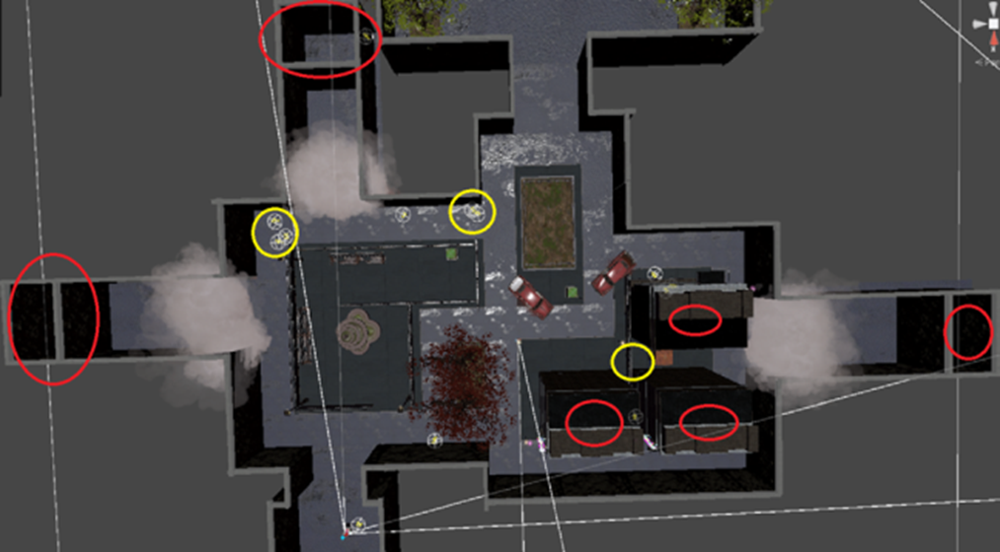
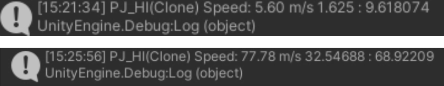
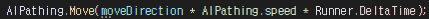
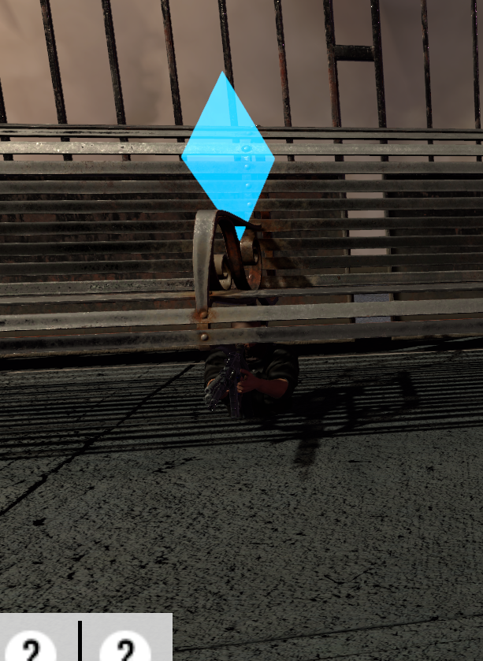

# INFEST 트러블슈팅 상세
# 네트워크 트러블슈팅
 "INFEST" 프로젝트 중에 작업을 아예 중단시키고 심리적인 좌절감을 느끼게 한 트러블슈팅은 전부 네트워크 관련입니다. 이론적으로 완벽한 해명이 힘들어서 대부분 변인 통제로 하나하나 찾아가며 해결했습니다.

### 몬스터가 원하는 위치에서 소환되지 않는 문제
(1) Fusion2의 네트워크 객체는 Runner.Spawn() 함수로 원하는 위치에 소환할 수 있습니다. MVP 테스트를 위해 몬스터를 소환했는데 이상하게도 몬스터가 어느 고정된 몇 몇 장소에서 소환되는 현상이 발생했습니다.

(2) 이해하기 힘든 현상이었습니다. 결국 이론적인 부분에서 해답을 찾지 못 하고 하나하나 독립 변인을 바꾸며 테스트했습니다. 그 결과 NavMesh 컴포넌트를 없애면 정상적인 스폰이 이루어짐을 확인했습니다. 관련 내용을 조사했으나 명확한 이론적 개념을 찾아내지 못했습니다. 추측상 NavMesh와 NetworkTransform이 서로 객체의 Transform을 제어하려다 서로 충돌해서 위 현상이 발생했다 여겨질 뿐이었습니다. 향후 지식을 습득하며 이 현상을 정확히 규명할 순간을 기다리고 있습니다.

(3) 네트워크 제어에 필수적인 NetworkTransform 대신 런타임 중에 실시간으로 돌아가는 NavMeshAgent를 비활성화한 채로 객체를 스폰하는 방식으로 해결했습니다.
    
### 몬스터 이동 속도가 호스트에 따라 달라지는 문제
(1) 빌드 파일을 팀원 모두가 각자 테스트하던 중, 팀원에 따라 좀비들의 이동속도가 다르다는 점을 확인했습니다.

(2) Time.deltaTime 보정이 없을 때 컴퓨터 프레임에 따라 결과값이 달라지는 유명한 사례가 있기 때문에 관련한 부분을 먼저 조사했습니다. 하지만 프레임에 따른 이동 속도는 놀랍게도 모든 씬, 컴퓨터에서 동일했습니다.

(3) 따라서 프레임 보정 외의 다른 요소를 고려해야 했습니다. 사용 중인 Photon Fusion 2를 중심으로 보정값을 찾기 시작했고, Runner.deltaTime이라는 네트워크 tick 보정 값이 있음을 알아냈습니다.

(4) Runner.deltaTime에 따른 이동 속도를 관측한 결과 극명한 차이가 발생했습니다.

(5) 기존 이동 로직을 담당하던 NavMesh.SetDestination()은 파라미터로 Runner.deltaTime 전달할 수 었어 대신 NavMesh.Move()를 사용해 해결했습니다.   

### 플레이어가 오브젝트와 살짝만 스쳐도 서로 겹쳐지게 되는 문제
(1) 사물 에셋을 추가해 맵에 배치했습니다. 네트워크 플레이어가 이와 살짝만 스쳐도 서로 겹침 상태가 되버렸습니다.

(2) 충돌에 문제가 있을 거라 생각해 에셋의 콜라이더를 확인했습니다. MeshCollider였는데 그 복잡한 구조가 네트워크 상에서의 충돌 처리에 오류를 발생시킬 거라 추측했습니다. 콜라이더를 Box로 단순화 시키자 예상대로 겹침 문제가 해결되었습니다.