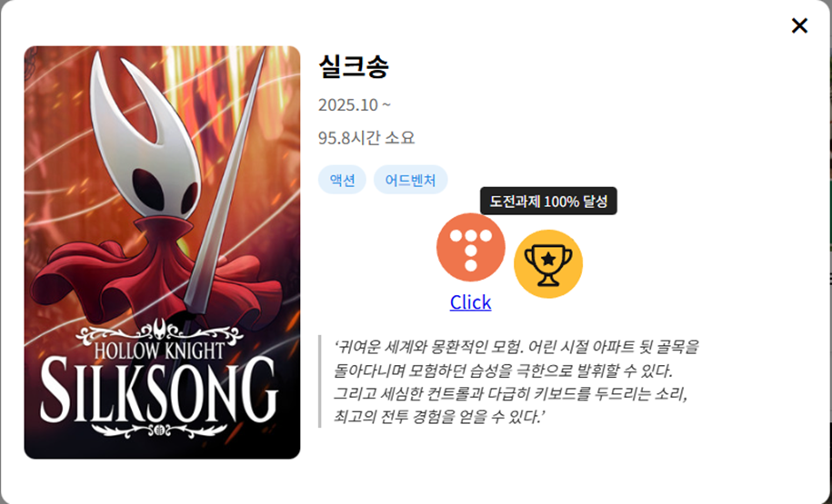
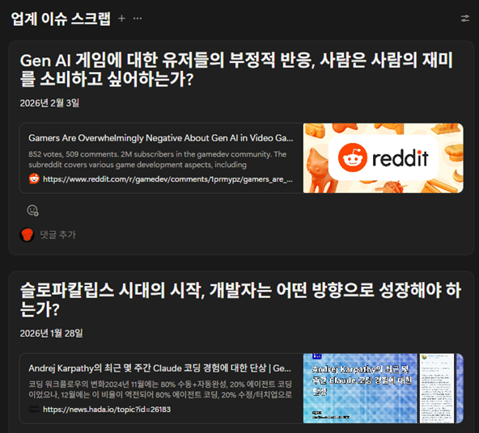

# 유승민 ( 1998.05.23 )

### 게임 클라이언트 개발자  

"AI를 명세 기반 개발에 활용해 게임 아이디어를 빠르게 검증하고, 탄탄한 기본기와 최적화를 통해 게임의 완성도를 끌어올리는 개발자를 지향합니다"   

# 프로젝트 #1 

### 게임 "INFEST" - 친구들과 함께 시원하게 총을 쏘며 스트레스를 푸는 게임
### 기술 스택 : Unity / Photon Fusion 2  
### 작업 개요
- 애니메이션 트리거, 피격 여부 등 ON/OFF 성격의 상태 플래그 동기화: 
- 애니메이션 트리거, 피격 여부 등 ON/OFF 성격의 상태 플래그 동기화에는 NetworkBool과 OnChangedRender 콜백을 사용했습니다.
- 게임 시작 투표, 상점 열람, 무기 구매 등의 단발성 상호작용 함수는 RPC로 실행했습니다.
- Host 토폴로지를 사용해 게임 플레이 시스템을 구현했습니다.
- Shared 토폴로지를 사용해 매치 메이킹 시스템을 구현했습니다.
### 작업 상세
[네트워크 작업 상세 보기](Docs/INFEST/network.md)

# 프로젝트 #2

### 게임 "수레기 머학생" - 

# 프로젝트 #3

### 연구 "Artificial Hunter Vision" - 

# 더보기
### [유승민의 게임 아카이브 바로가기](https://anbak98.github.io/timeline)

### [유승민의 개발 아카이브 바로가기](https://www.notion.so/native/20942be5b78c80c49a3bf0aa55328543?source=copy_link&deepLinkOpenNewTab=true)

